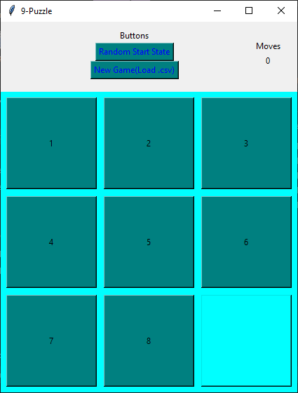

# 9-Puzzle Game
 
A simple implementation of the 9-Puzzle game made using Python for the module CMPG313 (Artificial Intelligence).

# Libraries Used: 
 - Tkinter for the GUI elements
 - csv to be able to read in a board state
 - random to create a random board state

# Screenshot

